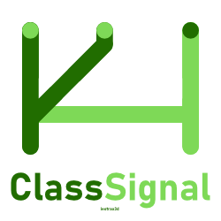

<div align="center">
  


</div>


# ClassSignal


<svg viewBox="0 0 200 200" xmlns="http://www.w3.org/2000/svg">
  <!-- Äußeres Quadrat mit abgerundeten Ecken (Klassenraum/System) -->
  <rect x="30" y="30" width="140" height="140" rx="20" fill="none" stroke="#2563eb" stroke-width="4"/>
  
  <!-- Vertikaler Balken (erhobene Hand/Meldung) -->
  <rect x="90" y="60" width="20" height="80" rx="10" fill="#2563eb"/>
  
  <!-- Kleines Dreieck oben (Richtung/Signal nach oben) -->
  <path d="M 100 45 L 110 60 L 90 60 Z" fill="#ef4444"/>
  
  <!-- Horizontale Linie unten (Basis/Pult) -->
  <rect x="60" y="145" width="80" height="6" rx="3" fill="#2563eb" opacity="0.5"/>
</svg>

<div align="center">


**Digital classroom engagement system using ESP32 devices for real-time student participation tracking**

[Features](#features) • [Installation](deployment/) • [About this Project](About_this_Project) • [License](LICENSE/) [Logbook](logbook)

</div>

---

## Overview

Class Signal is a self-contained classroom management system that enables students to signal participation through dedicated ESP32 hardware devices. Teachers receive real-time notifications via a web dashboard and can provide instant feedback. The entire system operates on a local network without requiring internet connectivity.

## Features

-  **Student Authentication** - Personal 4-digit codes with OLED feedback
-  **Instant Participation Signaling** - One-button press to join the discussion queue
-  **Real-time Teacher Dashboard** - Live updates via WebSocket
-  **Feedback System** - Direct assessment of student contributions
-  **Analytics & Reports** - Engagement statistics and CSV/YAML exports
-  **Local Network** - Complete data sovereignty, no internet required
-  **Low Latency** - Sub-second response times

## System Architecture

```
┌─────────────┐         WiFi          ┌──────────────────┐
│   ESP32     │◄─────────────────────►│  Raspberry Pi 4  │
│  (Student)  │      TCP/JSON         │   (AP + Server)  │
└─────────────┘                       └────────┬─────────┘
                                               │
┌─────────────┐                                |
│   ESP32     │◄───────────────────────────────|
│  (Student)  │         WiFi                   |
└─────────────┘                       ┌──────────────────┐
                                      │  Web Dashboard   │
                                      │    (Teacher)     │
                                      └──────────────────┘
```

## Usage

### For Students

1. Power on ESP32 device
2. Enter 4-digit personal code using buttons
3. Wait for "Willkommen [Name]" on display
4. Press button to signal participation
5. Display confirms when teacher acknowledges

### For Teachers

1. Open web dashboard
2. Monitor participation queue in real-time
3. Click on student names to acknowledge
4. Provide feedback after student contributions
5. View statistics and export reports


## Roadmap

- [x] Basic WiFi and TCP communication
- [ ] Student authentication system
- [ ] Web dashboard with live updates
- [ ] Feedback and rating system
- [ ] Statistical analysis and reports
- [ ] Multi-classroom support
- [ ] Mobile app for teachers

## Technical Requirements

**Hardware:**
- Raspberry Pi 4 (2GB+ RAM)
- ESP32  boards
- 0.96" OLED displays (I2C)
- Push buttons

**Software:**
- Raspberry Pi OS Bookworm
- Python 3.9+
- Modern web browser with WebSocket support

## Security

- WPA2/WPA3 encrypted local network
- No internet connectivity required
- All data stored locally on Raspberry Pi
- Personal authentication codes for students

## License
Apache 2.0
## Author

**Leonardo**

For questions or feedback, please open an issue on GitHub
